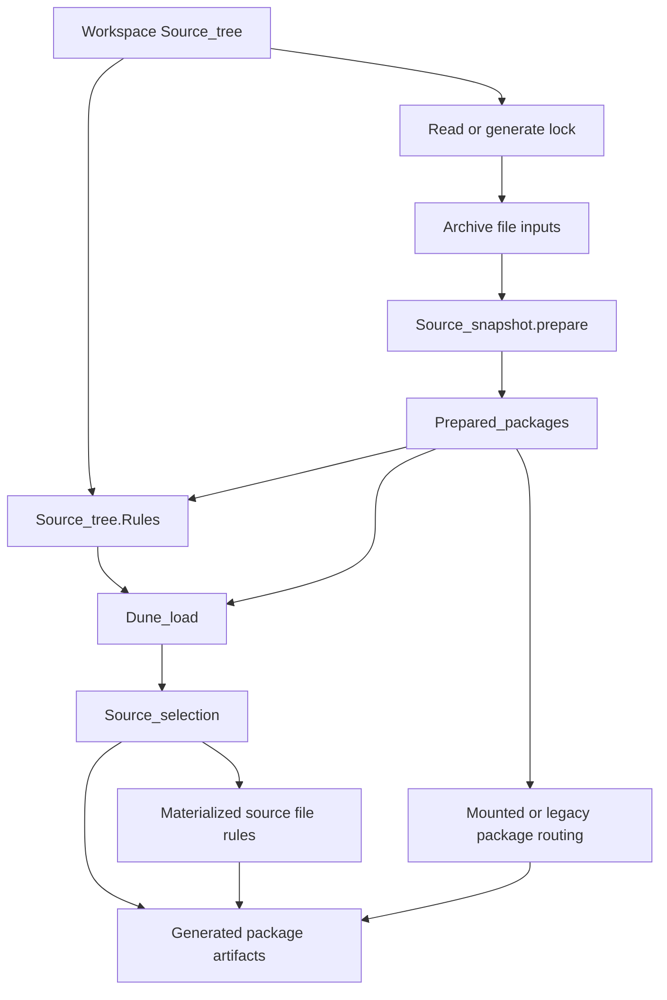

# Build locked Dune packages from immutable source snapshots

This file is the design plan for the next `flatten-dune` prototype. It starts from
change `omwxt` and incorporates the archived prototype's behavioral findings, but
it deliberately replaces both the archived virtual-source implementation and the
later directory-target proposal.

Directory targets are not part of this design.

## Goal

A locked package whose source is described by Dune should be loaded and built by
the current Dune process. Dune must not launch a nested Dune process for that
package.

An eligible mounted package:

- obtains its archive as an ordinary file input;
- exposes an immutable, content-addressed source snapshot to a rules-side loader;
- is loaded as a vendored Dune project without fabricating a workspace
  `Path.Source.t`;
- materializes only selected compilation inputs as ordinary file targets;
- owns generated files, objects, and install entries in an isolated physical
  output partition;
- never enters the existing `.pkg` build/install rules.

Packages outside the conservative eligibility boundary retain the existing package
rules and execute the translated action recorded in the lock. Local workspace
packages retain their existing behavior.

The source snapshot is a preparation input to rule generation, not a build
directory. Package artifacts still participate in the same rule graph as the
workspace.

## Explicit rejection of directory targets

A fetched package tree must not be represented as a Dune directory target.
Specifically, the implementation must not:

- declare an extracted package root with `(targets (dir ...))` or the internal
  directory-target equivalent;
- rely on `Build_under_directory_target` to enumerate package sources;
- execute `Dune_load` by traversing a directory target;
- place generated package rules beneath a directory target;
- use a directory target merely as a bootstrap step for another mounted source
  representation.

The source archive may be a regular file target. Every materialized source copy
and every generated artifact is also a regular file target. Directories beneath
the package output root are ordinary rule-generation directories, not targets.

## Prototype boundary

The complete prototype may mount local and HTTP(S) archives. It does not:

- mount Git, Mercurial, Darcs, remote rsync, or live local-directory sources;
- deduplicate equivalent package instances even when their archive digest is
  equal;
- teach the engine about packages, locks, snapshots, or package routing;
- expose the package output partition as a user-selected compilation context;
- infer that an unknown or dynamic program is equivalent to `dune`;
- add source-store garbage collection during the first prototype;
- retain compatibility with either archived prototype's internal APIs.

The first vertical milestone is narrower and is defined separately below.

## Path, identity, and ownership invariants

Path kinds retain their existing ownership policy:

- `Path.Source.t` is watched, user-owned workspace input and may be promoted to;
- `Path.Build.t` is graph-produced data, is not watched as workspace input, and
  is never a promotion destination;
- `Path.External.t` may be watched but must not be modified by build rules or
  promotion.

The snapshot store is the sole exception to ordinary user ownership of an external
path. Its implementation may populate a new cache entry before publishing it. Once
published, the entry is immutable and every consumer treats it as read-only
`Path.External.t` data.

The following are separate values and must never be reconstructed from one
another:

1. **Package identity**: the exact package in one lock universe.
2. **Project identity**: the stable semantic identity used by project, package,
   scope, and local-library logic.
3. **Source snapshot**: the immutable topology and bytes supplied to Dune
   language loading.
4. **Materialized input**: an ordinary file target created only when a rule needs
   a build-local source path.
5. **Artifact owner**: the physical partition and directory receiving generated
   files, objects, and install entries.

A mounted package uses these locations:

```text
archive input:
  local Path.External archive
  or _build/_fetch/.../file

immutable source snapshot:
  <dune-cache-root>/pkg-sources/v1/<archive-digest>/root

materialized inputs and artifacts:
  _build/<resolver>+lockfile/pkg/<package-id>/...
```

The cache root is not a build target and is never used as an output directory.
The output root contains only graph-owned file targets. A materialized source copy
is derived data, not the canonical source snapshot.

The engine receives the ordinary workspace `Source_tree` only. It sees mounted
packages through normal file dependencies and file-producing rules; it receives no
snapshot-aware callback or package-specific branch.

## Source snapshot store

`dune_pkg` owns a content-addressed source store, building on the existing
`Dune_pkg.Mount` archive traversal rather than exposing an extraction directory as
a Dune target.

```ocaml
module Source_snapshot : sig
  module Id : sig
    type t

    val digest : t -> Dune_digest.t
  end

  module Archive : sig
    type t =
      { path : Path.t
      ; filename : Filename.t
      ; digest : Dune_digest.t
      }
  end

  type t

  val prepare : Archive.t -> t Memo.t
  val id : t -> Id.t
  val readdir
    :  t
    -> Path.Local.t
    -> Dune_input.Entry_kind.t Filename.Map.t Memo.t
  val read_file : t -> Path.Local.t -> string Memo.t
  val file_path : t -> Path.Local.t -> Path.External.t
  val manifest_digest : t -> Dune_digest.t
  val provider : t -> Dune_input.Provider.t
end
```

`Source_snapshot.prepare`:

1. requires the archive file to exist or be built;
2. verifies the expected checksum before constructing `Archive.t`;
3. derives the store key from the archive byte digest and source-store format
   version, never from the URL or temporary path;
4. takes a per-key lock;
5. extracts into a sibling temporary directory;
6. applies the existing archive-root normalization and safe symlink policy;
7. records a sorted manifest containing files, directories, modes, and content
   digests;
8. atomically renames the complete entry into the store;
9. returns an immutable snapshot only after the manifest validates the entry.

An existing valid entry is reused without download or extraction. A partial or
invalid entry is never published. Concurrent Dune processes either create the same
entry once or reuse it after the lock holder publishes it.

The first prototype does not delete store entries. A later cache-GC design must
respect active leases and is independent of mounted-package rule ownership.

Only `Source_snapshot` may write beneath `pkg-sources/v1`. The path returned by
`file_path` is available solely for read dependencies and materialization. No
consumer may form store paths from `Id.t` or mutate, promote to, or clean them.

## Archive inputs

`Pkg_sources` obtains an archive file before preparing a snapshot:

- a local archive remains an external file dependency;
- an HTTP(S) archive uses the existing `_fetch` regular-file rule with checksum
  verification;
- unsupported transports route directly to legacy package rules.

There is no archive extraction rule. The archive file's digest is the explicit
input to `Source_snapshot.prepare`, and the resulting snapshot ID is an explicit
input to loading and rule generation.

Fetching and snapshot preparation remain separate decisions from mounted-versus-
legacy classification. A fetched archive may still classify as legacy.

## Type model

### `Package_instance`: exact lock-universe identity

`dune_pkg` owns the package identity shared by preparation, loading, and rules:

```ocaml
type Package_instance.t =
  { lock_id : Dune_digest.t
  ; name : Package_name.t
  ; version : Package_version.t
  ; package_digest : Dune_digest.t
  }
```

`lock_id` is the digest of the location-independent lock universe;
`package_digest` covers the selected lock package. Equal names and versions in
different locks remain distinct. Path formatting is centralized in
`Package_instance`; semantic consumers never recover an identity from a path.

### `Dune_input`: source bytes without fake source paths

`dune_lang` owns a provider abstraction used by project and Dune-file decoding.
It does not depend on `dune_pkg`:

```ocaml
module Dune_input : sig
  module Entry_kind : sig
    type t =
      | File
      | Dir
  end

  module Provider : sig
    type t

    val create
      :  id:Dune_digest.t
      -> diagnostic_root:string
      -> readdir:
           (Path.Local.t -> Entry_kind.t Filename.Map.t Memo.t)
      -> read_file:(Path.Local.t -> string Memo.t)
      -> t
  end

  module Dir : sig
    type t =
      | Workspace of Path.Source.t
      | Provider of
          { provider : Provider.t
          ; dir : Path.Local.t
          }

    val relative : t -> Path.Local.t -> t
    val readdir : t -> Entry_kind.t Filename.Map.t Memo.t
    val read_file : t -> Filename.t -> string Memo.t
    val diagnostic_name : t -> string
  end
end
```

`Source_snapshot` constructs a `Dune_input.Provider.t`; dependency direction stays
`dune_pkg -> dune_lang`, as it is today. The provider is identified and memoized by
its content digest, while its callbacks close over the opaque snapshot.

A provider input is not a disguised `Path.Source.t`, `Path.Build.t`, or
`Path.External.t`. Physical store paths do not participate in project equality,
scope identity, diagnostics, or output placement.

`Dune_project.gen_load` already accepts a custom read function and is used by
`Dune_pkg.Pin` to scan `Dune_pkg.Mount`. The new loader generalizes that pattern:

- project and stanza ownership queries take `Path.Local.t` relative to the
  project root;
- parser locations use `Dune_input.Dir.diagnostic_name` plus relative paths;
- rule generation obtains source providers from `Loaded_project.t`;
- no output path is derived from a `Dune_project.t` source path.

### `Source_tree.Rules`: a provider-backed forest

The existing `Source_tree` remains the workspace tree used by the engine. The
`source` library adds a separate rules-side forest for `Dune_load`:

```ocaml
module Source_tree.Rules : sig
  module Project_identity : sig
    type t =
      | Workspace of Path.Source.t
      | Mounted of
          { instance : Package_instance.t
          ; project_root : Path.Local.t
          }
  end

  module Owner : sig
    type t =
      | Workspace
      | Mounted of Package_instance.t
  end

  module Mount : sig
    type t =
      { instance : Package_instance.t
      ; snapshot : Source_snapshot.t
      ; visible_packages : Package.Name.Set.t
      }
  end

  module Dir : sig
    type t

    val input : t -> Dune_input.Dir.t
    val relative_dir : t -> Path.Local.t
    val project_identity : t -> Project_identity.t
    val owner : t -> Owner.t
    val status : t -> Source_dir_status.t
  end

  type t

  val create : workspace:Source_tree.Dir.t -> mounts:Mount.t list -> t Memo.t
  val roots : t -> Dir.t list
end
```

This view is a forest: the workspace and each mounted snapshot are independent
roots. It has no synthetic `pkg/` workspace path, overlay collision, or filesystem
assumption about mounted topology. Mounted roots and nested projects are always
vendored.

Workspace nodes use the existing source scanner. Snapshot nodes use only
`Source_snapshot.readdir` and `Source_snapshot.read_file`. They never call
`Fs_memo` on a temporary extraction path and never publish that path.

```text
engine source view = workspace Source_tree only
rules source view  = workspace root + snapshot-backed mounted roots
```

### `Build_partition`: explicit artifact ownership

`dune_rules` owns physical output placement independently of semantic resolution:

```ocaml
module Build_partition : sig
  type purpose =
    | Workspace
    | Mounted of Package_instance.t

  type t = private
    { build_context : Build_context.t
    ; resolver_context : Context_name.t
    ; output_root : Path.Build.t
    ; purpose : purpose
    ; implicit_workspace_targets : bool
    }

  val workspace : Context.t -> t
  val mounted : resolver:Context.t -> Package_instance.t -> t
  val dir : t -> Path.Local.t -> Path.Build.t
end
```

A mounted partition shares the resolver context's compiler, tools, findlib scope,
and host relationship. It is not entered in `Context.DB.all` as another semantic
workspace context, and `implicit_workspace_targets` is false. Alias, install, and
rule dispatch use typed capabilities, never a context-name suffix.

Local libraries, objects, binaries, and install entries carry their
`Build_partition.t` owner directly. A library name plus source path is never used
to recover its object owner.

### `Prepared_packages`: explicit routing input

`dune_rules` owns the immutable package set passed to all consumers:

```ocaml
module Prepared_packages : sig
  type legacy_reason =
    | Unsupported_source
    | Source_is_not_a_dune_project
    | Package_not_declared
    | Non_dune_action

  type mounted =
    { instance : Package_instance.t
    ; snapshot : Source_snapshot.t
    ; partition : Build_partition.t
    ; visible_packages : Package.Name.Set.t
    }

  type route =
    | Mounted of mounted
    | Legacy of legacy_reason

  type prepared_package =
    { instance : Package_instance.t
    ; lock_package : Dune_pkg.Lock_dir.Pkg.t
    ; archive : Source_snapshot.Archive.t option
    ; route : route
    }

  type t

  val prepare
    :  lock_path:Path.t
    -> lock:Dune_pkg.Lock_dir.t
    -> resolver:Context.t
    -> t Memo.t
end
```

`Prepared_packages.t` is passed explicitly to:

- `Source_tree.Rules.create`;
- `Dune_load`;
- mounted-versus-legacy package routing;
- mounted/legacy dependency integration.

There is no process-global publication reference, registry generation, or reverse
path-to-package lookup. Memoized consumers key directly on the immutable prepared
set and snapshot IDs.

Preparation may decode the root `dune-project` through the snapshot provider to
classify a source, but it must not invoke full mounted `Dune_load`. Complete project
decoding and semantic package masking happen later.

### `Loaded_project` and `Loaded_dir`

`dune_rules` owns the values passed from `Dune_load` into rule generation:

```ocaml
type Loaded_project.t =
  { project : Dune_project.t
  ; identity : Source_tree.Rules.Project_identity.t
  ; source_root : Dune_input.Dir.t
  ; partition : Build_partition.t
  ; output_root : Path.Build.t
  ; package_mask : Package.Name.Set.t option
  }

type Loaded_dir.t =
  { project : Loaded_project.t
  ; source : Dune_input.Dir.t
  ; relative_dir : Path.Local.t
  ; output_dir : Path.Build.t
  }
```

`Dune_file.t` carries a `Loaded_dir.t`; its directory accessor no longer returns a
`Path.Source.t`.

Compilation, preprocessing, generated modules, includes, OCaml-syntax Dune files,
scopes, artifacts, install entries, diagnostics, Merlin, and compile commands use
`Loaded_dir.source` for logical inputs and `Loaded_dir.output_dir` for generated
paths. They do not call `Path.Build.append_source` to derive one from the other.

## Source selection and materialization

`dune_rules` owns one per-directory precedence authority:

```ocaml
type Source_selection.selected =
  | Snapshot_file of
      { snapshot : Source_snapshot.t
      ; source : Path.Local.t
      ; materialized : Path.Build.t
      }
  | Workspace_file of
      { source : Path.Source.t
      ; materialized : Path.Build.t
      }
  | Generated of Path.Build.t
  | Absent
```

For one logical relative path, precedence is:

1. a standard or non-promoting form of a promote rule owns the generated output;
2. otherwise an existing workspace or snapshot file is selected and suppresses a
   fallback rule;
3. otherwise a fallback rule may own the output;
4. otherwise the path is absent.

A selected snapshot file is materialized only when a compiler or tool requires a
build-local path. Materialization is a normal copy rule:

- source: immutable `Path.External.t` returned by `Source_snapshot.file_path`;
- dependency: that exact source file and the snapshot manifest digest;
- target: one `Path.Build.t` beneath `Loaded_dir.output_dir`;
- action: ordinary file copy or hardlink-safe equivalent.

Materialized source files may share an output directory with generated artifacts
because both are ordinary, explicitly selected file targets. There is no unowned
source synchronization. `Source_selection` emits no copy rule when a generated
rule owns the corresponding path, and it discards a fallback rule when the
snapshot contains the path.

Dune language files are read directly through the snapshot provider and need not
be materialized. Selectors, module discovery, copy rules, and fallback filtering
all query `Source_selection`; no synthetic claim rule exists.

Promotion is rejected by `Build_partition` capability before a source destination
is formed. No path beneath the immutable source store is writable or promotable.

## Variant inspection boundaries

Direct pattern matching is deliberately narrow:

| Variant | Modules allowed to inspect it |
| --- | --- |
| `Dune_input.Dir.t` | `Dune_input`, `Source_tree.Rules`, `Dune_project` loading, `Source_selection` |
| `Project_identity.t` / `Owner.t` | `Source_tree.Rules`, `Dune_load`, semantic package masking |
| `Build_partition.purpose` | `Build_partition` and the top-level rule dispatcher |
| `Prepared_packages.route` | `Prepared_packages`, `Dune_load`, `Pkg_rules`, top-level setup |
| `Source_selection.selected` | `Source_selection`; callers use its operations |

Only `Source_snapshot` inspects or writes store layout. Diagnostics and formatting
use accessors. Artifact, library, install, and scope modules receive explicit
source and output values. A new path-prefix test or context-name predicate is not
an acceptable substitute for extending a typed interface.

## Dependency graph



The engine participates only by building regular archive files, source-copy files,
and artifacts. It does not consume snapshots or the rules-side source tree.

## Preparation without a loading cycle

Archive file rules are derived from lock data alone. For an HTTP source, the
existing `_fetch` rule produces one regular file. For a local archive, the source
is an external file dependency.

Preparation proceeds as follows:

```text
read lock
  -> obtain and verify archive file
  -> compute archive digest
  -> prepare/reuse immutable source snapshot
  -> classify mounted or legacy route
  -> construct rules-side source forest
  -> Dune_load
  -> generate materialization and artifact file rules
```

The snapshot exists before mounted `Dune_load`, so loading does not request a rule
whose generation depends on that same load. Materialization rules are generated
after loading and depend on immutable snapshot files; they are not prerequisites
for reading Dune language files.

The forbidden edges are:

```text
archive file rule generation -> mounted Dune_load
Source_snapshot.prepare       -> mounted Dune_load
snapshot file read            -> materialization rule
```

A changed local archive at the same path has a new byte digest, produces a new
snapshot ID, and invalidates the prepared package set. The old snapshot remains
immutable. No source refresh deletes or rewrites generated objects.

## Lock and classification semantics

The lock remains a cache of repository metadata. It stores each selected package's
complete translated action, including wrappers, environment updates, filters,
configure steps, and mixed commands. It does not store a `dune_based` verdict, and
routing never queries the opam repository after locking.

Source transport and build routing are separate decisions.

A package is a mount candidate when its main source is a local archive or an
HTTP(S) archive. Git, Mercurial, Darcs, remote rsync, live local-directory pins,
and packages without a source archive remain on existing package rules.

A candidate is mounted only when both conditions hold:

1. its snapshot contains a loadable `dune-project` whose complete package
   universe declares the exact locked package;
2. every unconditional executable step in the selected translated action is a
   literal `dune build ...` invocation.

Action-tree wrappers such as `chdir`, environment updates, and redirections are
transparent. A guarded step is not unconditional and does not veto mounting.
Mixed recipes, literal non-Dune commands, dynamic programs, shell commands,
patch/substitute/install actions, and unknown constructs fail closed to `Legacy`.

A failed classification is a routing decision, not a source-preparation error.
Fetch, checksum, extraction, and manifest-validation failures remain errors.
Source opam files may participate in ordinary project loading but never replace
repository data in the lock or decide routing.

Package masks are applied only after the complete Dune project and typed stanzas
have been decoded. Shared-source and nested-project ownership is a semantic
operation, not raw S-expression filtering during classification.

## Mounted and legacy interoperability

A mounted package never receives old `.pkg` build rules, a package cookie, or a
second build/install action.

A legacy package may depend on a mounted package. Dependency closure makes two
separate decisions:

- it does not request the mounted package's `.pkg` target or cookie;
- it does depend on the mounted package's concrete build/install output and
  receives its environment.

Mounted dependencies contribute install roots, `OCAMLPATH`, `PATH`, section paths,
binaries, exported variables, and transitive identity to legacy consumers. The
required integration chain remains:

```text
A: mounted Dune package
B: legacy package depending on and compiling/linking against A
C: workspace package depending only on B and resolving A transitively
```

Local-library identity comes from the shared resolver. Object and install
locations come from the library's explicit `Build_partition.t` owner.

## Autolock and invalidation

Autolock has two explicit loading phases:

1. load the workspace `Source_tree` only;
2. build and read the generated lock;
3. prepare immutable source snapshots and package routes;
4. create `Source_tree.Rules` and perform the normal load.

One `dune build` invocation completes both phases. There is no mutable registry to
publish into an already memoized tree; the immutable prepared set is an explicit
input to the second load.

Lock reads and archive decisions use tracked mechanisms. Local archive files are
watched external inputs. HTTP archives are regular build-file dependencies.
Snapshot cache entries are immutable and identified by content digest, so they do
not require filesystem invalidation after publication.

A single watch/RPC process must observe lock package addition/removal, local
archive changes, source/checksum replacement, action routing changes,
added/changed/removed Dune files and modules through a changed snapshot ID, and
package mount/deactivation changes.

## Mechanisms retained from the archived prototype

The new prototype retains these behavioral decisions:

- the lock stores translated actions, not a `dune_based` marker;
- source inspection decides whether a project is loadable;
- an explicit non-Dune action veto fails closed to legacy rules;
- source opam files do not replace repository data cached in the lock;
- package masking happens after complete project decoding;
- mounted roots use vendored behavior;
- no nested Dune process builds a mounted package;
- mounted packages strictly bypass old package build/install rules;
- legacy consumers receive mounted install outputs;
- lock generation remains workspace-only and autolock remains one invocation;
- mounted outputs remain isolated from ordinary workspace output paths.

The archived behavioral cram fixtures and real-package exercise are reusable after
the core snapshot path works.

## Mechanisms explicitly discarded

The new implementation must not contain:

- directory targets for fetched or mounted package sources;
- virtual `Path.Source.t` identities for package snapshots;
- `Source_tree.real_path` or an equivalent redirection callback;
- build-backed-source exceptions in engine copying, lookup, selectors, fallback
  handling, cleanup, or promotion;
- synchronized source trees beneath `_build`;
- build-start synchronization into the artifact root;
- synthetic package source claim rules;
- a process-global mounted-source registry or publication reference;
- registry generations used to invalidate hidden global state;
- reverse path-to-package, path-to-context, or source-to-output lookups;
- context-name predicates standing in for partition capabilities;
- library object ownership recovered from library name and source path.

The archived implementations may be consulted for observable behavior and
fixtures, but their path models are not scaffolds for this prototype.

## First vertical milestone

The first working milestone contains only:

- one explicit source lock;
- one local archive file;
- one package per archive;
- one immutable source snapshot;
- one literal translated `dune build` action;
- one snapshot-backed rules-side project load;
- ordinary file-target materialization for selected OCaml sources;
- one separate package artifact owner;
- one workspace library consuming the mounted library;
- no directory target;
- no nested Dune process;
- no old package build rule for the mounted package.

It excludes HTTP, extra sources, shared-source masking, nested projects,
legacy-package consumers, autolock, and source-store garbage collection. It is
complete only when the built Dune executable performs the path end to end and the
engine contains no mounted-source special case.

## Implementation order

1. **Implement the immutable snapshot provider.**
   - Reuse `Dune_pkg.Mount` traversal and archive normalization behind
     `Source_snapshot`.
   - Add content-addressed, locked, atomic cache publication.
   - Cover manifest stability, cache reuse, archive mutation, and extraction
     failure without involving `Dune_load`.

2. **Make source and artifact ownership explicit.**
   - Add `Dune_input`, `Package_instance`, `Build_partition`, `Loaded_project`,
     and `Loaded_dir`.
   - Migrate workspace loading to pass logical source and output directories
     separately without changing behavior.
   - Remove rule-layer use of `Dune_project.root` and
     `Path.Build.append_source` as artifact-location authorities.
   - Pass `nix develop -c dune build @check`.

3. **Build the minimal vertical path.**
   - Prepare one local archive snapshot from an explicit lock.
   - Construct `Source_tree.Rules` and load `dune-project`, `dune`, subdirectories,
     and modules through provider callbacks.
   - Materialize selected source files as regular file targets.
   - Generate the mounted library into its explicit output partition.
   - Link that library into one workspace library.
   - Assert no directory target, nested Dune action, or `.pkg` package rule.

4. **Centralize source precedence.**
   - Implement `Source_selection` for workspace, snapshot, generated, and
     fallback inputs.
   - Cover source versus generated standard/promote targets and source versus
     fallback targets.
   - Move selectors and module discovery to the same decision.

5. **Complete explicit path and artifact ownership.**
   - Migrate preprocessing, generated modules, includes, OCaml-syntax Dune files,
     scopes, artifacts, install entries, `%{lib}`, `%{bin}`, `%{pkg}`,
     diagnostics, Merlin, and compile commands.
   - Carry `Build_partition.t` on local libraries and installed artifacts.
   - Add the mounted-to-legacy dependency and environment bridge.

6. **Restore the proven semantic envelope.**
   - Add HTTP archive file targets and transport fallback controls.
   - Add conservative action vetoes, vendored behavior, promotion suppression,
     shared-source masks, and nested projects.
   - Exercise a real package graph as soon as HTTP and PPX are available.

7. **Add autolock and long-lived invalidation last.**
   - Implement the two explicit loading phases.
   - Cover lock, routing, archive, snapshot, stanza, and mount removal in one
     watch process.
   - Run the complete carried-forward behavior matrix.

No later phase starts by adding compatibility shims around a failing earlier path.
A source-provider or output-owner mismatch is fixed at its typed boundary.

## Required verification

### Architectural checks

The implementation must demonstrate:

1. No mounted-source rule declares a directory target.
2. The only graph-produced source transport is a regular archive file target.
3. Package topology and Dune language files are read through
   `Source_snapshot`, not a fabricated filesystem source path.
4. Snapshot cache entries are content-addressed, atomically published, immutable,
   and never modified by rules.
5. Every build-local source copy is an ordinary file target selected by
   `Source_selection`.
6. `src/dune_engine` has no package/snapshot logic, `real_path` callback, or
   mounted-source exception.
7. `Dune_load` receives `Prepared_packages.t` explicitly; there is no global
   registry handoff.
8. Output directories are carried by loaded values and libraries, not derived
   from source paths.
9. No behavior is selected by parsing a context name, cache path, or build path.
10. The archive file rule and snapshot preparation do not call mounted
    `Dune_load`.

### Behavioral checks

The completed prototype must cover:

1. End-to-end local-archive snapshot mount with no nested/external Dune process.
2. HTTP archive-file mount, plus explicit Git/VCS and live-directory fallback
   controls.
3. `dune pkg lock` -> `dune clean` -> first `dune build` succeeds while the
   immutable snapshot remains reusable.
4. No-lock autolock succeeds with mounted artifacts in one invocation.
5. True mounted A -> legacy B -> workspace C interoperability.
6. Two unchanged invocations avoid download, extraction, materialization, and
   compiler work while preserving mounted objects.
7. Stable-path local archive mutation creates a new snapshot and updates added,
   modified, and removed files without `dune clean`.
8. Shared-source package masking, implied package ownership, and one deterministic
   auxiliary nested-package owner.
9. Nested vendored projects build while recursive `runtest`/`fmt` aliases and
   warning policy retain vendored semantics.
10. Promote, promote-until-clean, and promote-only rules never write to snapshot
    cache entries.
11. Mounted packages produce no old `.pkg` directory, cookie, or package action.
12. Mounted source copies and artifacts are ordinary file targets beneath the
    package partition; each mounted module compiles once.
13. `%{lib}`, `%{bin}`, install paths, compile errors, and ocamldep paths use the
    explicit source and artifact owners.
14. Snapshot/generated/fallback ownership has no duplicate rules and follows the
    documented precedence.
15. A mounted package reserves or shadows no workspace source path.
16. One-process watch tests cover lock, routing, archive, snapshot, stanza, and
    mount removal changes.
17. Safe symlinked files and directories retain their source semantics; escapes,
    cycles, and broken links follow the documented archive policy.
18. The build remains independent of the opam repository after locking.
19. A real opam-repository lock such as `ocaml-re` completes `@install`, covering
    remote archives, shared sources, generated opam declarations, nested
    projects, PPX, Menhir, and OCaml-syntax Dune files.

Use the built `_build/default/bin/main.exe` for integration tests. Trace tests use a
fresh action cache when asserting process execution. Run focused tests first, then
`nix develop -c dune build @check`, the mounted-package cram group, transport
controls, and the real-package exercise.

## Review deliverables

The implementation review must include:

- the exact final definitions of all types above and any approved deviations;
- the source-store concurrency and immutability argument;
- the module dependency graph and variant-inspection table;
- annotated diffs for archive acquisition, snapshot preparation, provider-backed
  loading, source selection, materialization, partition ownership, and legacy
  interoperation;
- proof that no mounted source is a directory target or fake `Path.Source.t`;
- proof that the engine source view remains workspace-only;
- the focused and real-package verification record;
- a retrospective of failed approaches, remaining risks, and follow-up work.
